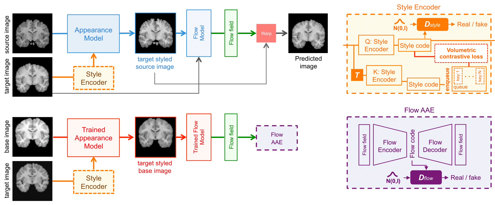

# Self-Supervised Generative Style Transfer for One-Shot Medical Image Segmentation

This repository contains the Pytorch implementation of the proposed method _Self-Supervised Generative Style Transfer for One-Shot Medical ImageSegmentation_ , which has been recently accepted at WACV 2022.

## Dependencies

We prefer to have a separate [anaconda environment](https://www.anaconda.com/) and the following packages to be installed.

1. `Python == 3.7`
2. `tensorflow-mkl == 1.15`
3. `pytorch == 1.6.0`
4. `torchvision == 0.7.0`
5. `pytorch-msssim == 0.2.1`
6. `medpy == 0.4.0`
7. `rasterfairy == 1.0.6`
8. `visdom`

## Training Modes
The implementaion of our method is available in the folder OURS.

1. Train FlowModel without Appearance Model.  
```
python train.py --ngpus 1  --batch_size 4 --checkpoints_dir_pretrained ./candi_checkpoints_pretrained --dataroot ../CANDIShare_clean_gz --train_mode ae --nepochs 10
```

2. Train StyleEncoder  
```
python train.py --ngpus 1 --batch_size 16 --checkpoints_dir_pretrained ./candi_checkpoints_pretrained --dataroot ../CANDIShare_clean_gz --train_mode style_moco --nepochs 10
```

3. Train Appearance Model  
```
python train.py --ngpus 1 --batch_size 1 --checkpoints_dir_pretrained ./candi_checkpoints_pretrained --dataroot ../CANDIShare_clean_gz --train_mode appearance_only --nepochs 10
```

4. Train Adversarial Autoencoder Flow  
```
python train.py --ngpus 1 --batch_size 2 --checkpoints_dir_pretrained ./candi_checkpoints_pretrained --train_mode aae --nepochs 100
```

5. Train End to End  
```
python train.py --ngpus 1 --batch_size 1 --checkpoints_dir ./candi_checkpoints --checkpoints_dir_pretrained ./candi_checkpoints_pretrained --dataroot ../CANDIShare_clean_gz --train_mode end_to_end --nepochs 10
```

For training on OASIS dataset, please change the `--dataroot` argument to `OASIS_clean` and `--nepochs 1`.

## Training Steps

1. First train Unet based flow model by running 1. from [Train Modes](#training-modes). This will be used to generate images of same styles for training the style encoder.

2. Pre-train style-encoder by running 2. from [Train Modes](#training-modes). This will pre-train our style encoder using volumetric contrastive loss.

3. Train end-to-end by running 5. from [Train Modes](#training-modes). This will train `Appearance Model`, `Style Encoder` and `Flow Model` end to end using pre-trained `Style Encoder`. set `--use_pretrain` to `False` for training `Style Encoder` from scratch.

4. Generate Flow Fields in the folder `../FlowFields` using trained end-to-end model by running the following command:  
```python generate_flow.py```

5. Train Flow Adversarial Autoencoder by running 4. from [Train Modes](#training-modes).

6. Generate image segmentation pairs using `python generate_fake_data.py`.

7. Train 3D Unet on the generated image segmentation dataset using the code provided in folder `UNET` and the following command:
```
python train.py --exp <NAME OF THE EXPERIMENT> --dataset_name CANDI_generated --dataset_path <PATH TO GENERATED DATASET>
```

### Schematic description of the training phase

<p align="center">
  <a target="_blank" rel="noopener noreferrer" href='OURS/pipeline_v2-1.png'></a>
</p>

## Evaluation Script

All evaluation scripts used to generate plots and compute dice score are included in the folder evaluations. To run a particular evaluation, run the following command provinding corresponding `opt` from the file `run_evaluations.py`:  
```python run_evaluations.py <opt>```

## Pre-trained Models
All pre trained models and datasets can be obtained from [here](https://drive.google.com/drive/folders/1yROhDxupFwICod-ImdG2FbGcLIEY8oUV?usp=sharing). Please unzip the trained models inside the directory `submission_id_675/code/OURS`.

____
## Citation
You can find the Self-Supervised Generative Style Transfer for One-Shot Medical Image Segmentation paper at http://arxiv.org/abs/2110.02117

If you find this work useful, please cite the paper:

```
@misc{tomar2021selfsupervised,
    title={Self-Supervised Generative Style Transfer for One-Shot Medical Image Segmentation},
    author={Devavrat Tomar and Behzad Bozorgtabar and Manana Lortkipanidze and Guillaume Vray and Mohammad Saeed Rad and Jean-Philippe Thiran},
    year={2021},
    eprint={2110.02117},
    archivePrefix={arXiv},
    primaryClass={cs.CV}
}
```
____

### Licence
<a rel="license" href="http://creativecommons.org/licenses/by-nc-nd/4.0/"></a><br />This work is licensed under a <a rel="license" href="http://creativecommons.org/licenses/by-nc-nd/4.0/">Creative Commons Attribution-NonCommercial-NoDerivatives 4.0 International License</a>.
